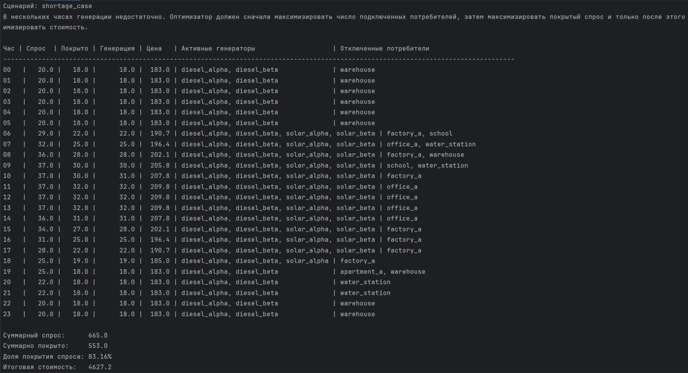
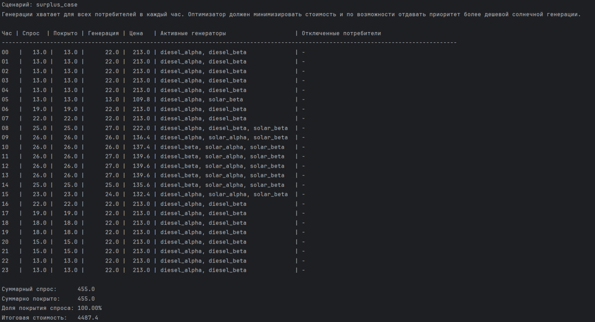
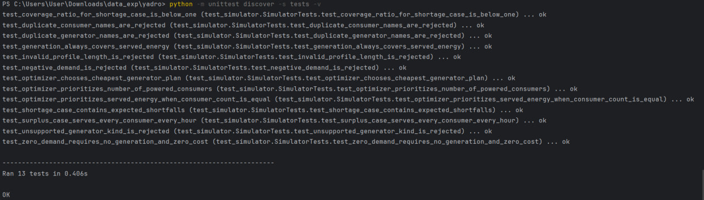

# Симулятор энергосети

## Постановка задачи

Проект моделирует энергосеть на горизонте 24 часов и строит почасовой план включения генераторов так, чтобы:

1. в каждый час по возможности обеспечить энергией всех потребителей;
2. минимизировать стоимость генерации;
3. если суммарной генерации не хватает, максимизировать число подключенных потребителей;
4. при одинаковом числе подключенных потребителей выбрать вариант с максимальным покрытием спроса;
5. среди таких вариантов выбрать наиболее дешевый.

## Структура проекта

```text
yadro/  
├── data/
│   ├── shortage_case.json
│   └── surplus_case.json
├── docs/
│   └── images/
│       ├── shortage_output.jpg
│       ├── surplus_output.jpg
│       └── tests_output.jpg
├── energy_grid_sim/
│   ├── __init__.py
│   ├── __main__.py
│   ├── cli.py
│   ├── loader.py
│   ├── models.py
│   ├── optimizer.py
│   ├── reporting.py
│   └── simulator.py
├── tests/
│   └── test_simulator.py
├── .gitignore
├── pyproject.toml
└── README.md
```

## Как запускать

Версия Python:

- `Python 3.13.1`

Сторонние библиотеки не используются.

Запуск сценария с избытком генерации:

```bash
python -m energy_grid_sim --scenario data/surplus_case.json
```

Ожидаемый вывод:



Запуск сценария с дефицитом генерации:

```bash
python -m energy_grid_sim --scenario data/shortage_case.json
```

Ожидаемый вывод:



Запуск тестов:

```bash
python -m unittest discover -s tests -v
```

Ожидаемый вывод:



## Формат входных данных

Каждый сценарий хранится в JSON и содержит:

- `consumers` — список потребителей с полями `name` и `hourly_demand`;
- `generators` — список генераторов с полями `name`, `kind`, `hourly_generation`, `cost_per_unit`.

Для всех временных профилей используется 24 значения, по одному на каждый час суток.

## Формат вывода

Программа печатает:

- почасовое расписание включенных генераторов;
- почасовой спрос, покрытый спрос и объем генерации;
- почасовую стоимость;
- список отключенных потребителей в часы дефицита;
- итоговую стоимость и долю покрытого спроса за сутки.

## Описание решения

Так как в постановке нет накопителей, ограничений на запуск и останов генераторов, штрафов за переключение режимов и межчасовых зависимостей, задача решается независимо для каждого часа.

Для каждого часа:

1. по генераторам запускается динамическое программирование, которое для каждого достижимого объема генерации хранит самый дешевый набор включенных источников;
2. по результату этой динамики определяется максимально доступная генерация в текущий час;
3. по потребителям запускается динамическое программирование по схеме задачи о рюкзаке;
4. динамика для каждого достижимого объема спроса хранит лучший набор потребителей с точки зрения:
   - максимального числа подключенных потребителей;
   - при равенстве числа подключенных — максимального покрытого спроса;
5. для каждого допустимого объема покрытия выбирается самый дешевый набор генераторов, который способен обеспечить этот объем;
6. из всех допустимых вариантов выбирается оптимальный план на час.

Идея улучшения по сравнению с полным перебором состоит в том, что ни потребители, ни генераторы не перебираются по всем подмножествам напрямую. Вместо этого используются две точные динамики: одна по потребителям, другая по генераторам. Это решение заметно лучше масштабируется и при этом сохраняет точность результата для текущей постановки.

Такой подход особенно естественен здесь, потому что при дефиците мощности задача по сути сводится к варианту рюкзака: нужно выбрать набор потребителей в пределах доступной мощности так, чтобы сначала максимизировать их количество, а затем максимизировать суммарный покрытый спрос. Аналогично, для генераторов в каждый час нужно выбрать набор источников, который обеспечивает нужный объем генерации с минимальной стоимостью, что тоже удобно формулируется как динамика по достижимым состояниям.

Важно, что простая жадная стратегия вида “сначала подключать самых маломощных потребителей” не гарантирует оптимальность по всем критериям задачи. Она может хорошо работать как эвристика для максимизации количества подключений, но не всегда корректно учитывает второй приоритет — максимизацию покрытого спроса при одинаковом числе подключенных потребителей. Поэтому в итоговом решении используется не жадный алгоритм, а точное динамическое программирование.

С точки зрения асимптотики итоговый подход выглядит так: и по генераторам, и по потребителям используется динамическое программирование по достижимым объемам вместо полного перебора всех подмножеств. Для учебного масштаба задачи это хороший компромисс между точностью, понятностью реализации и качеством алгоритмической идеи.

## Тестовые сценарии

### 1. `surplus_case`

- около 10 потребителей;
- 4 генератора;
- суммарной генерации хватает во все часы;
- ожидаемое поведение: отключений нет, а более дешевые солнечные источники используются там, где это выгодно.

### 2. `shortage_case`

- около 10 потребителей;
- 4 генератора;
- в ряде часов наблюдается дефицит;
- ожидаемое поведение: алгоритм отключает часть потребителей, но удерживает максимальное возможное число подключенных.

## Проверка корректности

Проверка выполнялась в нескольких слоях:

- ручной просмотр почасовых отчетов для обоих сценариев;
- автоматические тесты на покрытие спроса в сценарии с избытком;
- автоматические тесты на ожидаемое наличие отключений в сценарии с дефицитом;
- проверка инварианта `generated_energy >= served_energy` для каждого часа;
- проверка валидации некорректных входных данных, например дублирующихся имен и неподдерживаемых типов генераторов.

## Использование ИИ

ИИ использовался как инженерный помощник на нескольких этапах:

- для проектирования структуры репозитория и выделения модулей;
- для формализации критерия оптимизации и правил tie-break;
- для генерации черновых идей тестовых сценариев;
- для ускорения редактирования документации и повышения качества технической подачи;
- для дополнительного саморевью кода и поиска слабых мест в валидации входных данных.

Все предложения, полученные с помощью ИИ, были перепроверены вручную: код запускался локально, результаты сравнивались со здравым смыслом, а ключевые инварианты закреплялись тестами.

### Промпт 1. Проектирование архитектуры

```text
Выступи в роли senior Python engineer, который помогает подготовить репозиторий для технического задания на стажировку.

Задача:
Спроектируй аккуратную структуру Python-проекта для симулятора энергосети на 24 часа. В решении должны быть: модели предметной области, загрузка входных данных, оптимизационная логика, симуляция суток, форматирование отчета и тесты.

Ограничения:
- использовать только стандартную библиотеку Python;
- не переусложнять архитектуру;
- структура должна выглядеть профессионально на код-ревью;
- запуск должен быть удобен как из PyCharm, так и из терминала.

Ожидаемый ответ:
1. дерево каталогов;
2. назначение каждого файла;
3. краткое обоснование, почему такая структура хорошо подходит для стажировочного репозитория.
```

### Промпт 2. Формализация алгоритма оптимизации

```text
Выступи в роли инженера по алгоритмам.

Нужно предложить точный алгоритм для почасовой оптимизации энергосети на горизонте 24 часов.

Дано:
- около 10 потребителей с почасовыми профилями спроса;
- от 3 до 5 генераторов с почасовыми профилями генерации и стоимостью;
- два типа генераторов: дорогой постоянный дизель и более дешевая, но переменная солнечная генерация.

Цели оптимизации по каждому часу:
1. если энергии хватает, покрыть весь спрос с минимальной стоимостью;
2. если энергии не хватает, максимизировать число подключенных потребителей;
3. при равном числе подключенных потребителей максимизировать суммарный покрытый спрос;
4. при прочих равных минимизировать стоимость генерации.

Требования:
- не использовать внешние оптимизационные библиотеки;
- предпочесть точный детерминированный подход;
- объяснить вычислительную сложность и применимость подхода для масштаба задачи.

Формат ответа:
- описание алгоритма;
- правила разрешения равенств;
- псевдокод;
- список граничных случаев, которые нужно проверить тестами.
```

### Промпт 3. Подготовка тестовых сценариев

```text
Выступи в роли QA-инженера, который проектирует тестовые данные для алгоритмической задачи.

Сгенерируй два реалистичных сценария для симулятора энергосети:
- сценарий с избытком генерации;
- сценарий с дефицитом генерации.

Требования:
- в каждом сценарии должно быть около 10 потребителей и 4 генератора;
- должны присутствовать дорогие дизельные генераторы с постоянной мощностью и дешевые солнечные панели с переменной мощностью;
- профили спроса и генерации должны быть правдоподобными и легко объяснимыми на техническом интервью;
- в дефицитном сценарии отключения должны происходить в нескольких часах, а не только в одном.

Ожидаемый ответ:
1. готовые JSON-совместимые структуры;
2. пояснение, зачем нужен каждый профиль;
3. какие свойства алгоритма проверяет каждый сценарий.
```

### Промпт 4. Техническое ревью решения

```text
Выступи в роли строгого ревьюера take-home assignment на Python.

Проверь решение по следующим направлениям:
- логическая корректность;
- полнота валидации входных данных;
- детерминированность поведения;
- качество тестового покрытия;
- читаемость консольного отчета;
- убедительность README с точки зрения инженерного ревью.

Не переписывай решение целиком.

Формат ответа:
1. список замечаний в порядке убывания критичности;
2. конкретные улучшения;
3. недостающие тесты;
4. рекомендации по усилению презентации проекта на GitHub.
```

## Как проверялись ответы, полученные с помощью ИИ

Использовалась следующая схема проверки:

1. сначала формулировался узкий и проверяемый запрос;
2. затем результат сравнивался с постановкой задачи;
3. после этого код или данные проверялись локальным запуском;
4. инварианты и потенциальные регрессии закреплялись тестами;
5. финальная версия перечитывалась уже без опоры на ИИ, как обычный код-ревью.

## Тестовое покрытие

Помимо двух основных сценариев из задания, в проект добавлены дополнительные проверки на граничные и более сложные случаи:

- сценарий с нулевым спросом, где система не должна включать генераторы и тратить деньги;
- сценарий, проверяющий, что при дефиците алгоритм сначала максимизирует число подключенных потребителей;
- сценарий, проверяющий, что при одинаковом числе подключенных потребителей алгоритм выбирает вариант с большим покрытым спросом;
- сценарий, проверяющий выбор более дешевого набора генераторов среди нескольких допустимых;
- проверки невалидных входных данных: отрицательные значения, неверная длина профиля, дублирующиеся имена, неподдерживаемый тип генератора.


## Допущения и упрощения модели

В текущей модели приняты следующие упрощения:

- потребитель в рамках часа либо полностью обеспечен энергией, либо отключен;
- генератор либо включен полностью, либо выключен;
- стоимость считается линейно как `generated_energy * cost_per_unit`;
- накопители энергии отсутствуют;
- нет ограничений на скорость изменения мощности;
- нет стоимости запуска и остановки генератора;
- не учитываются потери в сети;
- не моделируется топология сети и пропускная способность линий;
- каждый час оптимизируется независимо.

## Возможные расширения

Варианты направления развития модели:

- приоритизация критически важных потребителей;
- частичное снабжение нагрузки вместо бинарной схемы “включен/отключен”;
- накопители энергии и межчасовая оптимизация;
- учет пусковых затрат и износа генераторов;
- учет выбросов CO2 как дополнительного критерия;
- работа на горизонте нескольких суток;
- вероятностные сценарии солнечной генерации и спроса;
- ограничения по линиям и реальная топология сети.

Если масштаб задачи существенно вырастет, например число потребителей станет измеряться сотнями или тысячами, а число генераторов и ограничений заметно увеличится, полный перебор уже перестанет быть практичным. В этом случае модель и алгоритм стоит эволюционно развивать в сторону более формальных методов оптимизации.

Для больших задач без сложной дискретной логики естественным следующим шагом будет линейное программирование. Если появляются бинарные решения вида “включить/выключить генератор”, “подключить/отключить потребителя”, “разрешить/запретить режим работы”, то более подходящим становится смешанно-целочисленное линейное программирование. Такой подход позволяет явно задать целевую функцию, ограничения по мощности, стоимости, приоритетам и межчасовым связям, а затем искать глобально оптимальный план уже не перебором, а через специализированный решатель.

Если в модели появляются потоки мощности по линиям, ограничения подстанций, баланс по узлам сети и топология графа, то задачу разумно формулировать как сетевую оптимизацию или как задачу потоков в графе с дополнительными ограничениями. Для многопериодного планирования с накопителями, запуском генераторов, минимальным временем работы и стохастическими сценариями спроса уже ближе подходы из задач планирования состава включенных мощностей, динамического программирования, стохастической оптимизации и предиктивного управления.

Если же размерность становится очень большой и требуется получать решение быстро, а не строго оптимально, можно переходить к приближенным и инженерно-практичным методам: жадным эвристикам, локальному поиску, методам декомпозиции, планированию на скользящем горизонте и метаэвристикам. В таком случае в отчете корректно написать, что для небольшой учебной постановки точный перебор удобен и прозрачен, а для промышленного масштаба более реалистичны модели смешанно-целочисленного линейного программирования, декомпозиция по времени или узлам сети и эвристические алгоритмы, дающие качественное решение за приемлемое время.

Если бы модель расширялась именно под большое количество потребителей, я бы отдельно указала переход от хранения потребителей как независимых объектов к агрегированным классам нагрузки. Например, бытовые, офисные, промышленные и критически важные потребители можно сначала оптимизировать по группам, а затем при необходимости детализировать внутри группы. Это снижает размер задачи и делает модель ближе к тому, как подобные системы часто описываются на практике.
